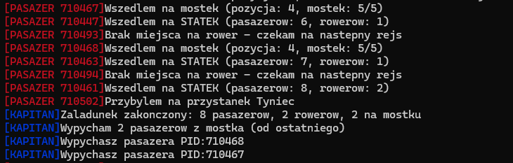
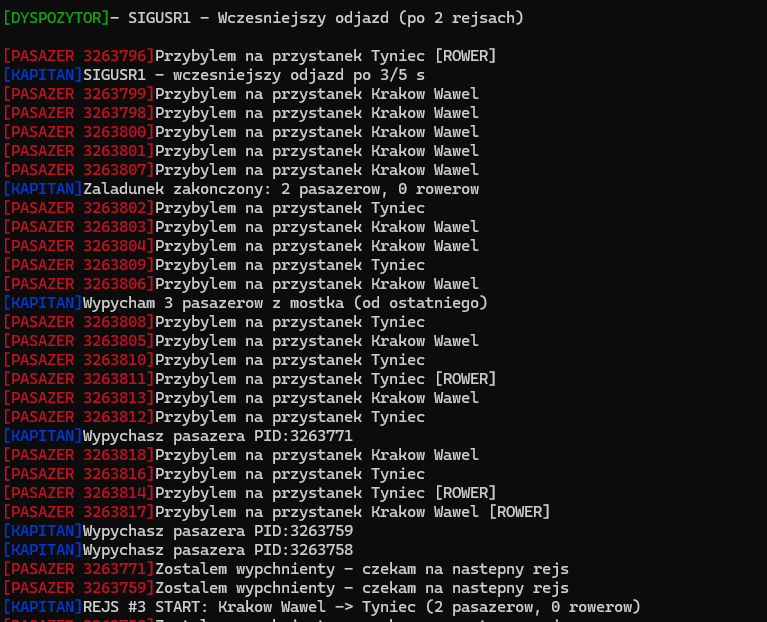
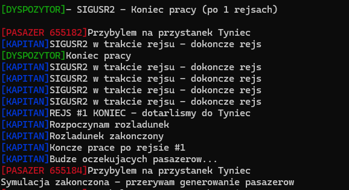
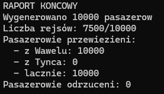

# Projekt Systemy Operacyjne - Tramwaj Wodny

**Autor** Paweł Drabik  
**Numer albumu** 155171  
[**Repozytorium Github**](https://github.com/LiIWind/Tramwaj_wodny)  

---

## 1. Opis projektu

W sezonie letnim po Wiśle na trasie Kraków Wawel – Tyniec kursuje tramwaj wodny o pojemności N
pasażerów. Dodatkowo tramwajem można przewieźć M rowerów (M<N). Statek z lądem jest
połączony mostkiem o pojemności K (K<N). Na statek próbują dostać się pasażerowie, z tym, że na
statek nie może ich wejść więcej niż N, a wchodząc na statek na mostku nie może być ich
równocześnie więcej niż K. Jeżeli na statek wchodzi osoba z rowerem na mostku zajmuje 2 miejsca.
Statek co określoną ilość czasu T1 (np.: jedną godzinę) wypływa w rejs. W momencie odpływania
kapitan statku musi dopilnować, aby na mostku nie było żadnego wchodzącego pasażera
(pasażerowie, którzy nie weszli na statek muszą zejść z mostka począwszy od ostatniego w kolejce).
Jednocześnie musi dopilnować by liczba pasażerów na statku nie przekroczyła N, a liczba rowerów
M. Dodatkowo statek może odpłynąć przed czasem T1 w momencie otrzymania polecenia (sygnał1)
od dyspozytora. Rejs trwa określoną ilość czasu równą T2. Po dotarciu do Tyńca pasażerowie
opuszczają statek. Po opuszczeniu statku przez ostatniego pasażera, kolejni (inni) pasażerowie
próbują dostać się na pokład w rejs powrotny (mostek jest na tyle wąski, że w danym momencie ruch
może odbywać się tylko w jedną stronę). Statek może wykonać maksymalnie R rejsów w danym dniu
lub przerwać ich wykonywanie po otrzymaniu polecenia (sygnał2) od dyspozytora (jeżeli to polecenie
nastąpi podczas załadunku, statek nie wypływa w rejs, a pasażerowie opuszczają statek. Jeżeli
polecenie dotrze do kapitana w trakcie rejsu statek kończy bieżący rejs normalnie – dopływa do
przystanku w Tyńcu lub w Krakowie.

## 2 Założenia projektowe

### 2.1 Kompilacja

```c
make clean

make

./main
```
<br/>
<br/>
<br/>
<br/>
<br/>
<br/>
<br/>
<br/>

### 2.2 Założenia zadania
- Pasażerowie przybywają na przystanki Wawel lub Tyniec losowo (50% szans)
- Pasażer może mieć rower (30% szans)
- Na tramwaj może wejść maksymalnie N pasażerów
- Na mostku może znajdować się jednocześnie K pasazerow
- Pasażer z rowerem zajmuje 2 miejsca na mostku
- Kapitan musi dopilnować, aby na mostku nie było żadnego pasażera w momencie odpływania
- Pasażerowie obecni na mostku podczas odpływania muszą go opuścić zaczynając od ostatniego w kolejce
- Tramwaj odpływa co T1 czasu, lub po otrzymaniu sygnału od dyspozytora
- Rejs trwa T2 czasu
- Tramwaj może wykonać maksymalnie R rejsów w ciągu dnia lub przerwać ich wykonywanie po otrzymaniu sygnału od dyspozytora
- Tramwaj kursuje na trasie Kraków Wawel - Tyniec
- Mostek jest jednokierunkowy

### 2.3 Architektura systemu
System oparty jest na architekturze wieloprocesowej z następującymi procesami:
- Main - Proces główny - tworzy zasoby IPC oraz uruchamia pozostałe procesy
- Kapitan - Zarządza statkiem, załadunkiem oraz rozładunkiem pasażerów
- Dyspozytor - Monitoruje symulację oraz wysyła sygnały do kapitana
- Pasażer - Próbuje wejść na statek


### 2.4 Parametry systemu
Następujące parametry są wprowadzane przez użytkownika:
- **N** - Pojemność tramwaju (maksymalna liczba pasażerów)
- **M** - Liczba miejsc na rowery (M < N)
- **K** - Pojemność mostka (K < N)
- **T1** - Czas załadunku w sekundach
- **T2** - Czas rejsu w sekundach
- **R** - Maksymalna liczba rejsów
<br/><br/><br/><br/><br/><br/>
### 2.5 Walidacja danych
Wszystkie wprowadzane parametry są walidowane:
- Wartości muszą być większe od 0
- M musi być mniejsze od N
- K musi być mniejsze od N
- Nieprawidłowe dane powodują wyświetlenie komunikatu błędu i ponowne zapytanie

### 2.6 Pliki projektu

| Plik | Opis |
|------|------|
| common.h | Definicje struktur, stałych, funkcji pomocniczych |
| logger.h | Nagłówek modułu logowania |
| logger.c | Implementacja systemu logowania |
| main.c | Proces główny - inicjalizacja i zarządzanie |
| kapitan.c | Logika kapitana statku |
| dyspozytor.c | Logika dyspozytora (wysyłanie sygnałów) |
| pasazer.c | Logika pojedynczego pasażera |

---

## 3. Opis implementacji

### 3.1 Mechanizmy IPC

#### 3.1.1 Pamięć dzielona

Pamięć dzielona służy do przechowywania wspólnych stanów systemu

```c
typedef struct {
    //Stany statku
    int pasazerowie_na_statku;
    int rowery_na_statku;
    int aktualny_przystanek;
    int liczba_rejsow;
    int koniec_symulacji;
    
    //Stan kapitana
    pid_t pid_kapitan;
    int status_kapitana;
    int zaladunek_otwarty;
    int rejs_id;
    
    //Kolejka na mostku
    PasazerInfo kolejka_mostek[MAX_PASAZEROW_MOSTEK];
    int liczba_na_mostku;
    int wypychanie_aktywne;

    int miejsca_zajete_mostek;
    
    //Lista wypchnietych w biezacym cyklu
    pid_t wypchnieci[MAX_PASAZEROW_MOSTEK];
    int liczba_wypchnietych;
    
    //Pasazerowie czekajacy na wejscie na statek
    int pasazerow_czekajacych_na_wejscie;
    
    //Pasazerowie na statku do rozladunku
    int pasazerow_do_rozladunku;
    
    //Statystyki
    int total_pasazerow_wawel;
    int total_pasazerow_tyniec;
    int pasazerow_odrzuconych;
} StanStatku;
```

#### 3.1.2 Semafory

System wykorzystuje 12 semaforów do synchronizacji:

| Semafor | Init | Funkcja |
|---------|------|---------|
| SEM_MUTEX | 1 | Wzajemne wykluczanie przy dostępie do pamięci dzielonej |
| SEM_MOSTEK | K | Licznik miejsc na mostku |
| SEM_STATEK_LUDZIE | N | Licznik miejsc na statku |
| SEM_STATEK_ROWERY | M | Licznik miejsc na rowery |
| SEM_LOGGER | 1 | Synchronizacja dostępu do pliku log |
| SEM_ZALADUNEK_WAWEL | 0 | Sygnalizacja otwarcia załadunku na Wawelu |
| SEM_ZALADUNEK_TYNIEC | 0 | Sygnalizacja otwarcia załadunku w Tyńcu |
| SEM_WEJSCIE | 0 | Kapitan wpuszcza pasażerów na statek |
| SEM_ROZLADUNEK | 0 | Sygnalizacja rozpoczęcia rozładunku |
| SEM_ROZLADUNEK_KONIEC | 0 | Ostatni pasażer sygnalizuje zejście |
| SEM_DYSPOZYTOR_READY | 0 | Dyspozytor czeka na gotowość kapitana |
| SEM_DYSPOZYTOR_EVENT | 0 | Zdarzenia dla dyspozytora |
<br/><br/><br/><br/>
#### 3.1.3 Sygnały

System obsługuje sygnały:

| Sygnał | Nadawca | Odbiorca | Działanie |
|--------|---------|----------|-----------|
| SIGUSR1 | Dyspozytor | Kapitan | Wcześniejszy odjazd przed czasem T1 |
| SIGUSR2 | Dyspozytor | Kapitan | Zakończenie pracy przed wykonaniem R rejsów |
| SIGUSR1 | Kapitan | Pasażer | Wypychanie pasażera z mostka |
| SIGTERM | Main | Wszystkie | Zakończenie symulacji |
| SIGINT | System | Main | Przerwanie przez użytkownika |

### 3.2 Algorytmy

#### 3.2.1 Algorytm załadunku pasażerów

```
1. Kapitan otwiera załadunek (ustawia flage)
2. Sygnalizuje otwarcie załadunku semaforem N razy
3. Przez T1 czasu:
  a. Sprawdza czy otrzymał sygnał do wcześniejszego odjazdu SIGUSR1
  b. Wpuszcza pasażerów z mostka na statek
  c. Sygnalizuje dyspozytorowi zdarzenie
4. Zamyka załadunek (czyści semafory)
5. Wypycha pasażerów pozostałych na mostku od ostatniego
6. Rozpoczyna rejs
```

#### 3.2.2 Algorytm wchodzenia pasażera na statek

```
1. Pasażer czeka na semafor załadunku odpowiedni dla jego przystanku
2. Rezerwuje miejsce na statku
3. Jeżeli ma rower to rezerwuje miejsce na rower
4. Rezerwuje miejsce na mostku (1 lub 2 dla rowerzysty)
5. Dodaje się do kolejki na mostku
6. Czeka na semafor wejścia
7. Sprawdza czy nie został wypchnięty
8. Wchodzi na statek i zwalnia miejsce na mostku
9. Czeka na rozładunek
10. Schodzi ze statku
```
<br/><br/><br/><br/><br/>
#### 3.2.3 Algorytm wypychania pasażerów z mostka

```
1. Kapitan pobiera liczbę pasażerów na mostku
2. Od ostatniego:
  a. Dodaje PID do listy wypchniętych
  b. Wysyła SIGUSR1 do pasażera
  c. Zwalnia miejsce na mostku
  d. Zwalnia miejsce zarezerwowane na statku
  e. Budzi pasażera
3. Zeruje kolejke na mostku
```

---

## 4. Opis implementacji

### 4.1 Proces główny main.c

1. Wczytuje parametry od użytkownika z walidacją
2. Tworzy pamięć dzieloną i semafory
3. Uruchamia proces kapitana (fork() i exec())
4. Uruchamia proces dyspozytora (fork() i exec())
5. Generuje procesy pasażerów (10000 procesów)
6. Czeka na zakończenie kapitana i dyspozytora
7. Generuje raport końcowy
8. Czyści zasoby

### 4.2 Proces kapitana

Główna pętla kapitana:

1. Otwórz załadunek
2. Przez T1 czasu wpuszczaj pasażerów
3. Zamknij załadunek
4. Wypchnij pasażerów z mostka
5. Rozpocznij rejs i płyń przez T2 czasu
6. Dotrzyj do celu
7. Rozładuj pasażerów
8. Powtórz

### 4.3 Proces dyspozytora

1. Monitoruj przebieg symulacji
2. Wyślij sygnał do wcześniejszego odjazdu po 2 rejsach
3. Wyślij sygnal do końca pracy po 75% rejsów

### 4.4 Proces pasażera

1. Przybądź na losowy przystanek z rowerem lub bez
2. Czekaj na otwarcie załadunku
3. Rezerwuj miejsce na statku
4. Rezerwuj miejsce na mostku
5. Wejdź na mostek
6. Czekaj na pozwolenie wejścia na statek
7. Wejdź na statek
8. Zwolnij miejsce na mostku
9. Czekaj na rozładunek
10. Zejdź ze statku
11. Zwolnij miejsce na statku
12. Koniec

---

## 5. Sekcje krytyczne kodu

### 5.1 Dostęp do pamięci dzielonej

Każdy dostęp do pamięci dzielonej jest chroniony semaforem `SEM_MUTEX`:

```c
// common.h - Implementacja operacji semaforowych
static inline int sem_wait(int semid, int sem_num) {
    return sem_op(semid, sem_num, -1, 0);  //czekaj
}

static inline int sem_signal(int semid, int sem_num) {
    return sem_op(semid, sem_num, 1, 0);   //sygnalizuj
}

// Przykład użycia w pasazer.c - wejście na statek
sem_wait(semid, SEM_MUTEX);               //POCZĄTEK SEKCJI KRYTYCZNEJ
usun_z_kolejki(wspolne, moj_pid);
wspolne->pasazerow_czekajacych_na_wejscie--;
wspolne->pasazerowie_na_statku++;
if (ma_rower) wspolne->rowery_na_statku++;
int na_statku = wspolne->pasazerowie_na_statku;
int rowerow = wspolne->rowery_na_statku;
sem_signal(semid, SEM_MUTEX);             //KONIEC SEKCJI KRYTYCZNEJ
```

**Wyjaśnienie:** semafor `SEM_MUTEX` jest inizjalizowany wartością 1. Operacja `sem_wait` zmniejsza wartość semafora - jeśli wynik jest ujemny to proces jest blokowany. Operacja `sem_signal` zwiększa wartość semafora i ewentualnie budzi oczekujący proces.
<br/><br/><br/><br/><br/><br/><br/><br/>
### 5.2 Zarządzenie kolejką na mostku

Dodawanie i odejmowanie pasażerów z kolejki na mostku jest kluczowe, aby zachować spójność:

```c
// pasazer.c - Dodanie pasazera do kolejki na mostku
static int dodaj_do_kolejki(StanStatku *wspolne, pid_t pid, int ma_rower) {
    if (wspolne->liczba_na_mostku >= MAX_PASAZEROW_MOSTEK) {
        return -1;
    }
    
    int idx = wspolne->liczba_na_mostku;
    wspolne->kolejka_mostek[idx].pid = pid;
    wspolne->kolejka_mostek[idx].ma_rower = ma_rower;
    wspolne->kolejka_mostek[idx].rozmiar = ma_rower ? 2 : 1;
    wspolne->liczba_na_mostku++;
    wspolne->miejsca_zajete_mostek += (ma_rower ? 2 : 1);
    
    return idx;
}
```

**Wyjaśnienie:** funkcja ta jest zawsze wywoływana wewnątrz sekcji krytycznej chronionej przez `SEM_MUTEX`, pozwala to na zapewnienie, że tylko jeden proces może modyfikować strukturę kolejki.

### 5.3 Wypychanie pasażerów z mostka

Algorytm wypychania pasażerów z mostka wymaga atomowej modyfikacji wielu zmiennych:

```c
// kapitan.c - Wypychanie pasażerów
void wypchnij_z_mostka(int semid, StanStatku *wspolne) {
    int liczba = wspolne->liczba_na_mostku;
    
    if (liczba == 0) return;
    
    wspolne->wypychanie_aktywne = 1;  // Flaga blokująca nowych pasażerów
    wspolne->liczba_wypchnietych = 0;
    
    // Wypychanie od ostatniego (LIFO)
    for (int i = liczba - 1; i >= 0; i--) {
        PasazerInfo *p = &wspolne->kolejka_mostek[i];
        
        // Dodaj do listy wypchniętych
        wspolne->wypchnieci[wspolne->liczba_wypchnietych++] = p->pid;
        
        // Wyślij sygnał do pasażera
        kill(p->pid, SIGUSR1);
        
        // Zwolnij zasoby
        sem_signal_n(semid, SEM_MOSTEK, p->rozmiar);
        wspolne->miejsca_zajete_mostek -= p->rozmiar;
        sem_signal(semid, SEM_STATEK_LUDZIE);
        if (p->ma_rower) sem_signal(semid, SEM_STATEK_ROWERY);
        
        // Obudź pasażera
        sem_signal(semid, SEM_WEJSCIE);
    }
    
    wspolne->liczba_na_mostku = 0;
    wspolne->miejsca_zajete_mostek = 0;
    wspolne->wypychanie_aktywne = 0;
}
```

**Wyjaśnienie:** 
- Flaga `wypychanie_aktywne` zapobiega wchodzeniu nowych pasażerów podczas wypychania
- Lista `wypchnieci[]` pozwala pasażerom sprawdzić czy zostali wypchnięci

### 5.4 Synchronizacja rozładunku

Ostatni pasażer schodzący ze statku powiadamia kapitana:

```c
// pasazer.c - Schodzenie ze statku
sem_wait(semid, SEM_MUTEX);
wspolne->pasazerowie_na_statku--;
if (ma_rower) wspolne->rowery_na_statku--;
wspolne->pasazerow_do_rozladunku--;

int ostatni = (wspolne->pasazerow_do_rozladunku == 0);  // Sprawdzenie atomowe
int nowy_przystanek = wspolne->aktualny_przystanek;
sem_signal(semid, SEM_MUTEX);

// ... zwalnianie zasobów ...

// Jeśli ostatni - powiadom kapitana
if (ostatni) {
    sem_signal(semid, SEM_ROZLADUNEK_KONIEC);
}
```
**Wyjaśnienie:** Sprawdzenie czy pasażer jest ostatni musi być atomowe i odbywać się wewnątrz sekcji krytycznej. W innym przypadku dwóch pasażerów mogłoby uznać się za ostatnich.

### 5.5 Obsługa sygnałów

Handlery sygnałów używają `volatile sig_atomic_t` dla bezpiecznej komunikacji:

```c
// kapitan.c
static volatile sig_atomic_t wczesniejszy_odjazd = 0;
static volatile sig_atomic_t koniec_pracy = 0;

void sigusr1_handler(int sig) {
    (void)sig;
    wczesniejszy_odjazd = 1;  // Atomowa operacja zapisu
}

void sigusr2_handler(int sig) {
    (void)sig;
    koniec_pracy = 1;
}

// W głównej pętli:
for (int sekunda = 0; sekunda < T1; sekunda++) {
    if (wczesniejszy_odjazd) {  // Atomowy odczyt
        // Przerwij załadunek
        break;
    }
    // ...
}
```

**Wyjaśnienie:**
- `volatile` zapobiega optymalizacji przez kompilator
- `sig_atomic_t` gwarantuje atomowy zapis/odczyt w kontekście obsługi sygnałów
- Handler sygnału może być wywołany asynchronicznie, więc musi być bezpieczny

---

## 6. Testy

### 6.1 **Test nr. 1**
Opuszczanie mostka od ostatniego w kolejce

Założenia: Dowolne parametry

Oczekiwanie: Pasażerowie będący na mostku po skończonym załadunku opuszczają go od ostatniego

Wynik: Sukces


<br/><br/><br/><br/>
### 6.2 **Test nr. 2**
Test sygnału do wcześniejszego odpłynięcia

Założenia: `R` > 4

Oczekiwanie: Kapitan po otrzymaniu sygnału przerwie załadunek, wypchnie pasażerów z mostka od ostatniego i rozpocznie rejs

Wynik: Sukces



### 6.3 **Test nr. 3**
Test sygnału do zakończenia pracy podczas rejsu

Założenia: `R` > 4

Oczekiwanie: Dyspozytor wyśle sygnał do końca pracy podczas rejsu, a kapitan dokończy rejs i po rozładunku zakończy pracę

Wynik: Sukces



### 6.4 **Test nr. 4**
Test sygnału do zakończenia pracy podczas załadunku

Założenia: `R` > 4 oraz odkomentować w dyspozytor.c [`&& status == STATUS_ZALADUNEK`](https://github.com/LiIWind/Tramwaj_wodny/blob/b1aaed87d1d29fb48ff553e8f1c43850a4d27c1f/dyspozytor.c#L134)

Oczekiwanie: Kapitan po otrzymaniu sygnału przerwie załadunek, a pasażerowie opuszczą statek, a następnie kapitan oraz dyspozytor zakończą pracę

Wynik: Sukces


### 6.5 **Test nr. 5**
Test miejsc rowerów

Założenia: Miejsca na rowery (M) ustawione na 1

Oczekiwanie: Pasażer z rowerem próbuję wejść na statek na którym aktualnie znajduję się rower i wysyła komunikat `Brak miejsca na rower - czekam na nastepny rejs`

Wynik: Sukces


### 6.6 **Test nr. 6**
Wszyscy pasażerowie z Wawelu

Założenia: Parametry dowolne, zakomentować w pasazer.c [`int moj_przystanek = (rand() % 2) ? PRZYSTANEK_WAWEL : PRZYSTANEK_TYNIEC;`](https://github.com/LiIWind/Tramwaj_wodny/blob/f67e833f79d373b83068b545add52123380effbc/pasazer.c#L67) oraz odkomentować [`int moj_przystanek = PRZYSTANEK_WAWEL;`](https://github.com/LiIWind/Tramwaj_wodny/blob/f67e833f79d373b83068b545add52123380effbc/pasazer.c#L68)

Oczekiwanie: W raporcie końcowym liczba pasażerów przewieźionych z Tyńca wyniesie 0

Wynik: Sukces



**Wszystkie testy przebiegły pomyślnie**

---

## 7. Co udało się zrealizować

### 7.1 Zrealizowane funkcjonalności

- ✅ Pełna implementacja symulacji tramwaju wodnego zgodna ze specyfikacją
- ✅ Wieloprocesowa architektura z użyciem fork() i exec()
- ✅ Synchronizacja procesów z użyciem semaforów
- ✅ Pamięć dzielona do wymiany danych między procesami
- ✅ Obsługa sygnałów SIGUSR1, SIGUSR2, SIGTERM, SIGINT
- ✅ Poprawne wypychanie pasażerów z mostka od ostatniego w kolejce
- ✅ Zarządzanie miejscami na rowery
- ✅ System logowania z synchronizacją dostępu
- ✅ Walidacja parametrów wejściowych
- ✅ Raport końcowy z statystykami
- ✅ Czyszczenie zasobów IPC przy zakończeniu
<br/><br/><br/><br/>
### 7.2 Elementy wyróżniające

- **Kolorowe wyjścia w terminalu** - procesy kapitana, dyspozytora oraz pasażera są wyraźnie rozróżnialne
- **System logowania** - zdarzenia są zapisywane do pliku .log z timestampami

---

## 8. Napotkane problemy

### 8.1 Procesy zombie
Duża liczba procesów pasażerów (10000) powodowała gromadzenie się zombie.

**Rozwiązanie:** Implementacja aktywnego zbierania zombie przez `waitpid(WNOHANG)` co 100 pasażerów oraz handler `SIGCHLD`.

### 8.2 Problem przy sprawdzaniu ostatniego pasażera
Dwóch pasażerów mogło uznać się za ostatniego schodzącego ze statku.

**Rozwiązanie:** Dodanie sprawdzenia `pasazerow_do_rozladunku == 0` do wnętrza sekcji krytycznej.

---

## 9. Linki do fragmentów kodu

### 9.1 Tworzenie i obsługa plików (open(), close(), read(), write(), unlink())

| Funkcja | Plik | Link |
|---------|------|------|
| fopen() - otwarcie pliku log | logger.c | [Link do kodu](https://github.com/LiIWind/Tramwaj_wodny/blob/0eb86a31e0e19a0be8b32e0b8de762fd9925da32/logger.c#L60-L65) |
| fclose() - zamknięcie pliku log | logger.c | [Link do kodu](https://github.com/LiIWind/Tramwaj_wodny/blob/0eb86a31e0e19a0be8b32e0b8de762fd9925da32/logger.c#L77-L82) |
| fprintf() - zapis do pliku | logger.c | [Link do kodu](https://github.com/LiIWind/Tramwaj_wodny/blob/0eb86a31e0e19a0be8b32e0b8de762fd9925da32/logger.c#L68-L75) |
| unlink() - usunięcie pliku | main.c | [Link do kodu](https://github.com/LiIWind/Tramwaj_wodny/blob/0eb86a31e0e19a0be8b32e0b8de762fd9925da32/main.c#L517) |
| fopen/fscanf/fclose - plik konfiguracji | common.h | [Link do kodu](https://github.com/LiIWind/Tramwaj_wodny/blob/0eb86a31e0e19a0be8b32e0b8de762fd9925da32/common.h#L283-L296) |

### 9.2 Tworzenie i obsługa procesów (fork(), exec(), exit(), wait())

| Funkcja | Plik | Link |
|---------|------|------|
| fork() - tworzenie kapitana | main.c | [Link do kodu](https://github.com/LiIWind/Tramwaj_wodny/blob/0eb86a31e0e19a0be8b32e0b8de762fd9925da32/main.c#L232-L239) |
| fork() - tworzenie dyspozytora | main.c | [Link do kodu](https://github.com/LiIWind/Tramwaj_wodny/blob/0eb86a31e0e19a0be8b32e0b8de762fd9925da32/main.c#L253-L261) |
| fork() - tworzenie pasażerów | main.c | [Link do kodu](https://github.com/LiIWind/Tramwaj_wodny/blob/0eb86a31e0e19a0be8b32e0b8de762fd9925da32/main.c#L306-L316) |
| execl() - uruchomienie kapitana | main.c | [Link do kodu](https://github.com/LiIWind/Tramwaj_wodny/blob/0eb86a31e0e19a0be8b32e0b8de762fd9925da32/main.c#L241-L246) |
| waitpid() - czekanie na procesy | main.c | [Link do kodu](https://github.com/LiIWind/Tramwaj_wodny/blob/0eb86a31e0e19a0be8b32e0b8de762fd9925da32/main.c#L385-L388) |
| exit() - zakończenie procesu | pasazer.c | [Link do kodu](https://github.com/LiIWind/Tramwaj_wodny/blob/0eb86a31e0e19a0be8b32e0b8de762fd9925da32/pasazer.c#L117) |
<br/>

### 9.3 Obsługa sygnałów (kill(), signal(), sigaction())

| Funkcja | Plik | Link |
|---------|------|------|
| sigaction() - rejestracja handlerów | kapitan.c | [Link do kodu](https://github.com/LiIWind/Tramwaj_wodny/blob/0eb86a31e0e19a0be8b32e0b8de762fd9925da32/kapitan.c#L129-L132) |
| kill() - wysyłanie SIGUSR1 | dyspozytor.c | [Link do kodu](https://github.com/LiIWind/Tramwaj_wodny/blob/0eb86a31e0e19a0be8b32e0b8de762fd9925da32/dyspozytor.c#L120) |
| kill() - wysyłanie SIGUSR2 | dyspozytor.c | [Link do kodu](https://github.com/LiIWind/Tramwaj_wodny/blob/0eb86a31e0e19a0be8b32e0b8de762fd9925da32/dyspozytor.c#L135) |
| kill() - wypychanie pasażera | kapitan.c | [Link do kodu](https://github.com/LiIWind/Tramwaj_wodny/blob/0eb86a31e0e19a0be8b32e0b8de762fd9925da32/kapitan.c#L56) |
| signal() - ignorowanie SIGTERM | main.c | [Link do kodu](https://github.com/LiIWind/Tramwaj_wodny/blob/0eb86a31e0e19a0be8b32e0b8de762fd9925da32/main.c#L349) |

### 9.4 Synchronizacja procesów (ftok(), semget(), semctl(), semop())

| Funkcja | Plik | Link |
|---------|------|------|
| ftok() - generowanie klucza | main.c | [Link do kodu](https://github.com/LiIWind/Tramwaj_wodny/blob/0eb86a31e0e19a0be8b32e0b8de762fd9925da32/main.c#L170-L176) |
| semget() - tworzenie semaforów | main.c | [Link do kodu](https://github.com/LiIWind/Tramwaj_wodny/blob/0eb86a31e0e19a0be8b32e0b8de762fd9925da32/main.c#L201-L208) |
| semctl(SETVAL) - inicjalizacja | main.c | [Link do kodu](https://github.com/LiIWind/Tramwaj_wodny/blob/0eb86a31e0e19a0be8b32e0b8de762fd9925da32/main.c#L213-L224) |
| semctl(IPC_RMID) - usuwanie | main.c | [Link do kodu](https://github.com/LiIWind/Tramwaj_wodny/blob/0eb86a31e0e19a0be8b32e0b8de762fd9925da32/main.c#L505-L509) |
| semop() - operacje P/V | common.h | [Link do kodu](https://github.com/LiIWind/Tramwaj_wodny/blob/0eb86a31e0e19a0be8b32e0b8de762fd9925da32/common.h#L106-L114) |

### 9.5 Segmenty pamięci dzielonej (ftok(), shmget(), shmat(), shmdt(), shmctl())

| Funkcja | Plik | Link |
|---------|------|------|
| shmget() - tworzenie segmentu | main.c | [Link do kodu](https://github.com/LiIWind/Tramwaj_wodny/blob/0eb86a31e0e19a0be8b32e0b8de762fd9925da32/main.c#L178-L184) |
| shmat() - przyłączenie segmentu | main.c | [Link do kodu](https://github.com/LiIWind/Tramwaj_wodny/blob/0eb86a31e0e19a0be8b32e0b8de762fd9925da32/main.c#L186-L193) |
| shmdt() - odłączenie segmentu | main.c | [Link do kodu](https://github.com/LiIWind/Tramwaj_wodny/blob/0eb86a31e0e19a0be8b32e0b8de762fd9925da32/main.c#L199) |
| shmctl(IPC_RMID) - usuwanie | main.c | [Link do kodu](https://github.com/LiIWind/Tramwaj_wodny/blob/0eb86a31e0e19a0be8b32e0b8de762fd9925da32/main.c#L511-L515) |

---

## 10. Struktura plików

```
tramwaj_wodny/
├── common.h           # Definicje struktur, stałych, funkcji pomocniczych
├── logger.h           # Nagłówek modułu logowania
├── logger.c           # Implementacja systemu logowania
├── main.c             # Proces główny
├── kapitan.c          # Proces kapitana
├── dyspozytor.c       # Proces dyspozytora
├── pasazer.c          # Proces pasażera
├── Makefile           # Plik kompilacji
├── README.md          # Dokumentacja projektu
├── img/               # Screenshoty z testów
│   ├── schemat.png
│   ├── test_mostek.png
│   ├── test_sigusr1.png
│   ├── test_sigusr2.png
│   ├── test_sigusr2_rejs.png
│   └── test_rower.png
└── tramwaj_wodny.log  # Plik logu (generowany podczas działania)
```

---

## 11. Podsumowanie

Projekt tematu nr. 11 "Tramwaj wodny" zrealizowany zgodnie ze specyfikacją oraz wymaganiami projektowymi.
Zaimplementowano wszystkie wymagane funkcjonalności tj.:
- Wieloprocesowa symulacjia z użyciem fork() i exec()
- Synchronizacja za pomocą semaforów
- Komunikacja poprzez pamięć dzieloną
- Obsługa sygnałów
- Prawidłowe czyszczenie zasobów IPC
